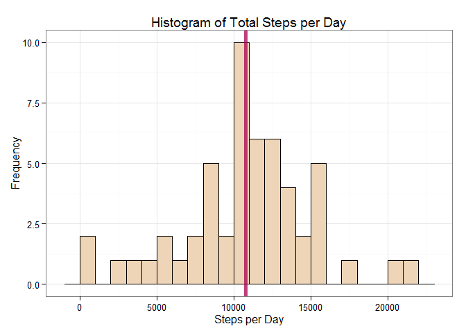
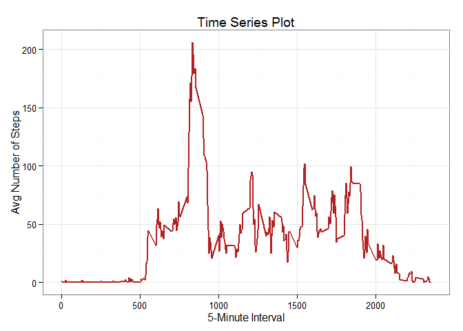
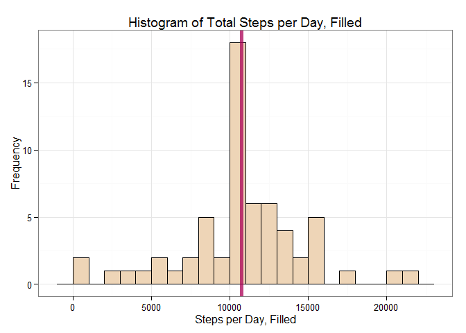
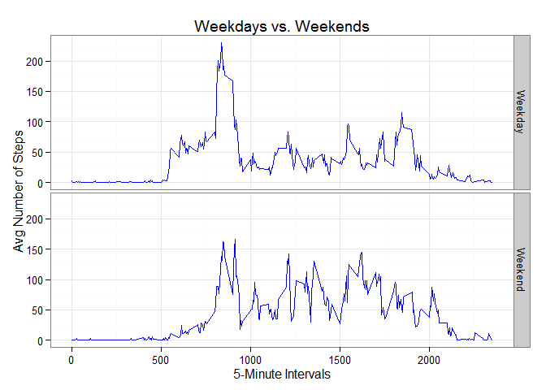

# Reproducible Research, Project 1
Tiffany Stoeke  
October 10, 2015  
##Executive Summary

This assignment makes use of data from a personal activity monitoring device. This device collects data at 5 minute intervals through out the day. The data consists of two months of data (a total of 17,568 observations) from an anonymous individual collected during the months of October and November, 2012, and includes the number of steps taken in 5 minute intervals each day.

The variables included in this dataset are:
  steps: Number of steps taking in a 5-minute interval (missing values are coded as NA)
  date: The date on which the measurement was taken in YYYY-MM-DD format
  interval: Identifier for the 5-minute interval in which measurement was taken

In this project, we will show a number of plots and calculations after making various processing transformations of the data such as imputing missing values.  The goal is to have all steps be entirely reproducible for verification purposes.

##Loading and Preprocessing the Data
Below is the code needed to load and transform the data into a useable data set, including loading ggplot2 and removing the N/A values from the data set.


```r
##Instructions for downloading the data
data <- download.file("http://d396qusza40orc.cloudfront.net/repdata%2Fdata%2Factivity.zip", "activity.zip")
data <- unzip("activity.zip")
data <- read.csv("activity.csv",header=TRUE)

##Load required plotting package
library(ggplot2)

##Process/transform the data into a useable data set, removing N/A rows
str(data)
```

```
## 'data.frame':	17568 obs. of  3 variables:
##  $ steps   : int  NA NA NA NA NA NA NA NA NA NA ...
##  $ date    : Factor w/ 61 levels "2012-10-01","2012-10-02",..: 1 1 1 1 1 1 1 1 1 1 ...
##  $ interval: int  0 5 10 15 20 25 30 35 40 45 ...
```

```r
compldata<-na.omit(data)
compldata$date<-as.Date(compldata$date)
compldata$steps<-as.numeric(compldata$steps)
```

##What is mean total number of steps taken per day?
Below we show a histogram of the aggregate number of steps taken per day.  On our histogram, I have added a blue line to show the mean value and a red line to show the median value of the data.  If these values are close in number, a red line + a blue line = a purple line.


```r
##Aggregate the data by date, adding the total steps per day
spd<-aggregate(steps~date,compldata,sum)

##Plot a histogram of the total steps per day.  Note that red+blue vlines = purple vline!
g<-ggplot(spd,aes(x=spd$steps))+theme_bw()+geom_histogram(fill="bisque2",color="black",binwidth=1000)
g<-g+geom_vline(xintercept=mean(spd$steps,na.rm=TRUE),size=2,color="blue",alpha=.5)+
  geom_vline(xintercept=median(spd$steps,na.rm=TRUE),size=2,color="red",alpha=.5)
g<-g+xlab("Steps per Day")+ylab("Frequency")+ggtitle("Histogram of Total Steps per Day")
g
```

 

Here are the actual calculated values of the mean and median of the data:


```r
mean(spd$steps,na.rm=TRUE)
```

```
## [1] 10766.19
```

```r
median(spd$steps,na.rm=TRUE)
```

```
## [1] 10765
```

##What is the average daily activity pattern?
With the below time series plot, we can see that the maximum number of steps on average across all the days in the dataset appears to be a little over 200 and that this occurs right around the 835 mark.


```r
##Aggregate the number of steps per 5-minute interval, take the mean of each interval
spi<-aggregate(steps~interval,compldata,mean)

##Create a time-series plot of the 5-minute intervals and the mean of steps taken per interval
g<-ggplot(spi, aes(spi$interval, spi$steps))+geom_line(color="firebrick",size=1)+theme_bw()
g<-g+xlab("5-Minute Interval")+ylab("Avg Number of Steps")+ggtitle("Time Series Plot")
g
```

 

Let's verify this with the actual calculations:


```r
##Show a summary of the aggregated interval data
summary(spi$steps)  ##Shows 206.2 (rounded) as max average steps in any interval
```

```
##    Min. 1st Qu.  Median    Mean 3rd Qu.    Max. 
##   0.000   2.486  34.110  37.380  52.830 206.200
```

```r
spi$interval[which.max(spi$steps)]  ##Shows 8:35am as max
```

```
## [1] 835
```

##Imputing missing values
There are 2,304 rows in our original data set which show NA rather than a true step value - the presence of these NAs may introduce bias into some calculations or summaries of the data.  To deal with this issue, we have devised the strategy of filling in the missing values with the mean of the 5-minute interval for which the step value is missing.  The below code creates a new data set with filled-in values and creates a new plot based on the now-complete data set.


```r
sum(is.na(data))  ##Shows 2,304 lines with NAs 
```

```
## [1] 2304
```

```r
##Create a new data frame, a copy of the original data set with NAs included.
newDF<-data
##Convert dates and steps as done with original data set
newDF$date<-as.Date(newDF$date)
newDF$steps<-as.numeric(newDF$steps)

##Creates a for-loop that writes over any NA values with the mean of that 5-minute interval
for (i in 1:nrow(newDF)) {
  if (is.na(newDF$steps[i])){
    newDF$steps[i] <- spi[which(newDF$interval[i] == spi$interval), ]$steps
  }
}
##Aggregate the new filled-in data set by date, adding the total steps per day
spd2<-aggregate(steps~date,newDF,sum)

##Plots a new histogram using the filled-in data set
g<-ggplot(spd2,aes(x=spd2$steps))+theme_bw()+geom_histogram(fill="bisque2",color="black",binwidth=1000)
g<-g+geom_vline(xintercept=mean(spd2$steps,na.rm=TRUE),size=2,color="blue",alpha=.5)+
  geom_vline(xintercept=median(spd2$steps,na.rm=TRUE),size=2,color="red",alpha=.5)
g<-g+xlab("Steps per Day, Filled")+ylab("Frequency")+ggtitle("Histogram of Total Steps per Day, Filled")
g
```

 

Here are the actual calculated values of the mean and median of the now-complete data set.  As we can see, the impact of filling in the mean values is very small, as the differences between our original mean and median and the new mean and median are negligible.


```r
##Obtains the new mean and median from our filled-in data set
mean(spd2$steps)
```

```
## [1] 10766.19
```

```r
median(spd2$steps)
```

```
## [1] 10766.19
```

##Are there differences in activity patterns between weekdays and weekends?
To see if there is a difference in activity patterns between weekdays and weekends, below we add two new columns to our filled-in data set - one which indicates the day of the week to which the particular data row belongs, and another which indicates whether this day is on a weekday or weekend.


```r
##Create another new data frame to protect what we've done so far
newDFdays<-newDF
##Adds a new column to our data set listing the specific day of the week
newDFdays$day<-weekdays(newDFdays$date)

##Runs a for-loop that looks for days that are weekends vs. weekdays
dotw <- function(x){
  if(x %in% c("Saturday", "Sunday")) {
    return("Weekend")
  }
 else(return("Weekday"))
}

##Creates a new "weekday" column that uses the for-loop to populate whether the specific
##day is during the weekend vs. weekday
newDFdays$weekday<-as.factor(sapply(newDFdays$day,dotw))
```

After aggregating our mean steps by both interval and weekday vs weekend, we create the below time series plots for comparison purposes:


```r
##Aggregates the means of the steps by weekday and by 5-minute interval
final<-aggregate(steps~interval+weekday,newDFdays, mean)

##Creates a panel plot to show the difference in the means of steps between weekdays vs weekends
g<-ggplot(final,aes(x=interval, y=steps))+geom_line(color="blue")+facet_grid(weekday~.)+theme_bw()
g<-g+xlab("5-Minute Intervals")+ylab("Avg Number of Steps")+ggtitle("Weekdays vs. Weekends")
g
```

 

From these panel plots, we can see that while the peak step value is much higher during the weekdays, on average the weekends show more sustained activity as a whole.
